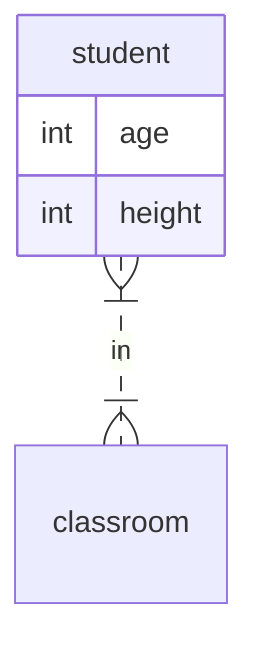

# incremental parsing with tree-sitter

veha suwatphisankij
slide: https://vehas.github.io/tree-sittery


---

# why ?
xkcd.com/comics/tasks.png


---
# today goal, on Parser
## 1. what is it
## 2. how to play with it
## 3. how to make a new one
---

# what is parser
#### program that given structured text, formal grammar turn to data structure
## text + grammar -> data structure
---

text          : 1 * 2 + 3
grammar       : root -> num (ops num)+ 
data structure: 



---
# incremental parser (tree sitter)
#### parse faster the next time you parse almost the same thing
  - realtime interactive text editor
    - neovim (https://neovim.io/doc/treesitter/)
    - helix
    - code mirror (lezer)
  - github (small change in commit)
    - code diff
    - syntax highlight
    - "go to ..." in the web
    - vulnerability check
---

# speed

Speed - When initially parsing a file, tree-sitter-rust takes around twice as long as Rustc's hand-coded parser.
```
$ wc -l examples/ast.rs
  2157 examples/ast.rs

$ rustc -> (7 ms)

$ tree-sitter -> 16 ms then -> 1 ms
```

---

# use case
## for (incremental) parser
- Complex text manipulation
  - syntax highlighting
  - code formatter
  - linting rules
  - code search
  - vulnerability check
  - code visualization
  - rust macro
---

# use parser
text + grammar -> AST
AST + tree query -> useful data
AST + visitor pattern -> useful AST

---
## project

## sql -> graphql
## rust -> graphql
---
# use parser
## build from C
```rust
    let gql_dir: PathBuf = ["tree-sitter-graphql", "src"].iter().collect();
    cc::Build::new()
        .include(&gql_dir)
        .file(gql_dir.join("parser.c"))
        .compile("tree-sitter-graphql");
```

---

# AST example
```sql
create table student(
        age int,
        height int,
        friend_count int);
```
---
# AST example
```lisp
(program
  (statement
    (create_table
      (keyword_create) (keyword_table)
      (table_reference
        name: (identifier))
        (column_definitions
          (column_definition
            name: (identifier)
            type: (keyword_int))
          (column_definition
            name: (identifier)
            type: (keyword_int))
          (column_definition name: (identifier) type: (keyword_int))))))
```
---

# query
```lisp
(create_table 
        (_)*
        (table_reference 
            name: (identifier) @name
        ) 
        (column_definitions 
            (
                (column_definition 
                    name: (identifier) @attr_name
                    type: (_) @attr_type
                )
                _*
            )+
        )
    )
```
---

# query result

name -> student
attr_name -> age, height
attr_type -> int, int

---

# code generator
```rust
strfmt(
static GRAPHQL_HEAD: &str = strfmt("type {name} {{{{\n{{body}}\n }}}}", table_name);
static GRAPHQL_BODY: &str = strfmt("    {name}: {type}, \n", body));
```
---

# make a new parser

---

# make a new parser 
### mermaid.js
### example



---
# mermaid spec

https://github.com/mermaid-js/mermaid/blob/develop/src/diagrams/er/parser/erDiagram.jison 

---

# test first : mermaid example, result

```lisp
erDiagram
  student {
    int age
    int height
  }
(er_digram
  (statement
    (identifier)
    (attributes
      (attribute
        (identifier)
        (identifier))
      (attribute
        (identifier)
        (identifier)))))
```
---

## parser
```js
module.exports = grammar({
    name: 'er_mermaid',
    rules: {
        er_digram: $ => seq('erDiagram', repeat($.statement)),
        statement: $ => choice(
            $.identifier, seq($.identifier, $.attributes),
        ),
        attributes: $ => seq(
            '{', repeat($.attribute), '}'
        ),
        attribute: $ => seq(
            field('type', $.identifier),
            field('name', $.identifier)
        ),
        identifier: _ => /([a-zA-Z_][0-9a-zA-Z_]*)/
    }});
```

---

# other rust parser
- https://www.shadaj.me/writing/introducing-rust-sitter/
- https://pest.rs/

---

# thank you
## Q & A

all code include this presentation is on https://github.com/vehas/tree-sittery