# incremental parsing with tree-sitter

veha suwat
github.com/vehas
fb.com/vehas

---

# why ?

---

# why ?
as a programmer, we want to growth toolkit over time 

---

# what is parser
#### program that given structured text, formal grammar turn data structure
## text + grammar -> data structure
---

text          : 1 * 2 + 3
grammar       : root -> num (ops num)+ 
data structure: 

[comment]: # (graph TD           )
[comment]: # (   R[Root] --> A[1])
[comment]: # (       R --> B[*]  )
[comment]: # (       B --> C[2]  )
[comment]: # (       R --> D[+]  )
[comment]: # (       D --> E[3]  )

---
# incremental parser (tree sitter)
#### parse faster the next time you parse almost the same thing
  - realtime interactive text editor
    - neovim (https://neovim.io/doc/treesitter/)
    - helix
    - code mirror (lezer)
  - github (small change in commit)
    - code diff
    - syntax highlight
    - "go to ..." in the web
    - vulnerability check
---

# use case
## for (incremental) parser
- Complex text manipulation
  - syntax highlighting
  - code formatter
  - linting rules
  - code search
  - vulnerability check
  - code visualization
  - data pipeline
  - rust macro
---

regular expressions vs LR(1) parser

---

# use parser
text + grammar -> AST
AST + tree query -> useful data
AST + visitor pattern -> useful AST

---
## project
### graphql <-> sql <-> rust <-> mermaid

# sql -> graphql
---
# use parser
## build from C

---

# AST example

---

# query

---

# code generator

---

# make a new parser

---

# make a new parser
## mermaid.js

---

# show mermaid result

---

# test first

---

## fun

---

# other rust parser
- https://www.shadaj.me/writing/introducing-rust-sitter/
- https://pest.rs/

---

# thank you
## Q & A